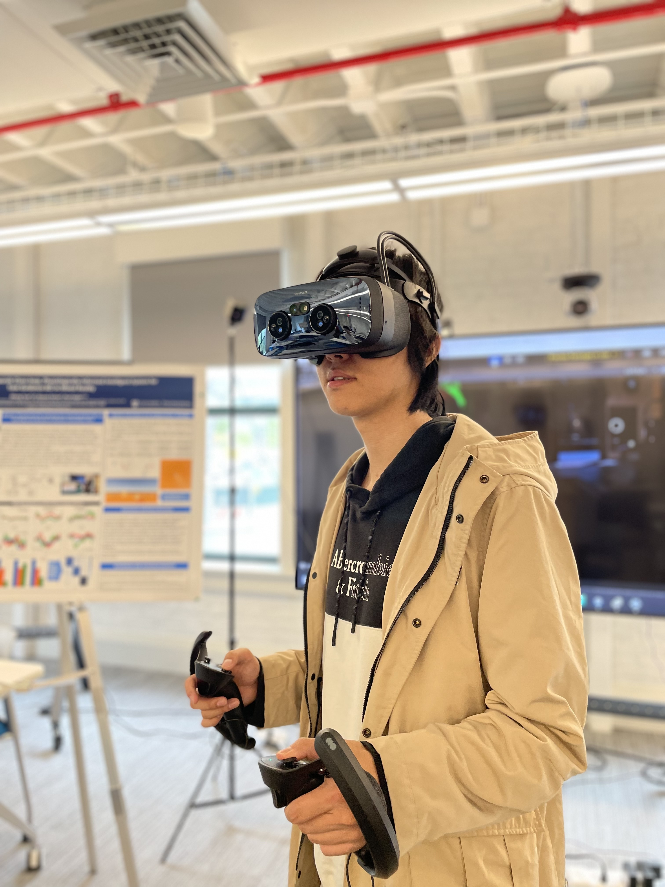

{: .align-right width="300px"}
Welcome! I'm a dynamic researcher, inventive game developer, and a passionate pianist with an unwavering love for Chopin. With a strong foundation in computer science and electrical engineering, I specialize in pioneering brain-computer interface (BCI) technology. My work focuses on integrating advanced physiological data to create real-time, accessible signal processing solutions through machine learning and deep learning techniques. Driven by a desire to bridge gaps and create opportunities, I am dedicated to advancing Human-Computer Interaction and biomedical imaging to improve lives and make technology accessible to all.

## Education

**Columbia University**  
*Sep 2022 - May 2024*
- Master of Computer Science (Thesis Track)
- Thesis Topic: From Brain–Computer Interfaces to AI-Enhanced Diagnostics: Developing Cutting-Edge Tools for Medical and Interactive Technologies
- Research in Brain-Computer Interfaces and Neuroimaging
- GPA: 3.81

**Worcester Polytechnic Institute**  
*Aug 2018 - May 2022*
- Bachelor Of Computer Science & Electrical and Computer Engineering (Double Major)
- Mechanical Engineering (Minor)
- Human-Computer Interaction
- GPA: 3.91

## Publications

**\* These Authors Contributed Equally.**

- **_Wei, Haowen_**\*, Ziheng Li\*, Alexander D. Galvan, Zhuoran Su, Xiao Zhang, Kaveh Pahlavan, and Erin T. Solovey. "IndexPen: Two-Finger Text Input with Millimeter-Wave Radar." *Proceedings of the ACM on Interactive, Mobile, Wearable and Ubiquitous Technologies* 6, no. 2 (2022): 1-39. [Paper](https://dl.acm.org/doi/10.1145/3534601)
- Xie, Xing, **_Haowen Wei_**, and Yongjie Yang. "Real-Time LiDAR Point-Cloud Moving Object Segmentation for Autonomous Driving." *Sensors* 23, no. 1 (2023): 547. [Paper](https://www.mdpi.com/1424-8220/23/1/547)
- Su, Zhuoran, Kaveh Pahlavan, Emmanuel Agu, and **_Haowen Wei_**. "Proximity Detection During Epidemics: Direct UWB TOA Versus Machine Learning Based RSSI." *International Journal of Wireless Information Networks* 29, no. 4 (2022): 480-490. [Paper](https://link.springer.com/article/10.1007/s10776-022-00577-4)
- Cheng, Shiyu, Kaveh Pahlavan, **_Haowen Wei_**, Zhuoran Su, Seyed Reza Zekavat, and Ali Abedi. "A Study of Interference Analysis Between mmWave Radars and IEEE 802.11 AD at 60 GHz Bands." *International Journal of Wireless Information Networks* 29, no. 3 (2022): 222-231. [Paper](https://link.springer.com/article/10.1007/s10776-022-00564-9)
- Ziheng Li\*, **_Haowen Wei_**\*, Ziwen Xie, Yunxiang Peng, June Pyo Suh, Steven Feiner, Paul Sajda. "PhysioLabXR: A software platform for real-time multi-modal, brain-computer interfaces and extended reality experiments." *Journal of Open Source Software*, Sep 2023. [Paper](https://joss.theoj.org/papers/10.21105/joss.05854), [GitHub](https://github.com/PhysioLabXR/PhysioLabXR)

## Conference Talks

- **2023 Brain & Human Body Modeling (BHBM)** - Athinoula A. Martinos Center for Biomedical Imaging (Hybrid Local Conference): "PhysioLabXR: A software platform in Python for multi-modal brain-computer interface and real-time experiment pipelines." **Haowen Wei**, Ziheng Li, Steven Feiner, Paul Sajda
- **2022 Brain & Human Body Modeling (BHBM)** - Athinoula A. Martinos Center for Biomedical Imaging (Hybrid Local Conference): "Hardware, real-time signal processing techniques, and data collection for TMS induced EMG responses with RenaLabApp." **Haowen Wei**, Mohammad Daneshzand
- **2021 Brain & Human Body Modeling (BHBM)** - Athinoula A. Martinos Center for Biomedical Imaging (Hybrid Local Conference): "Interplay between TES and EEG Interplay with boundary element fast multipole method (BEM-FMM) via Helmholtz reciprocity principle." Sergey Makarov, **Haowen Wei**, Aapo Nummenmaa

