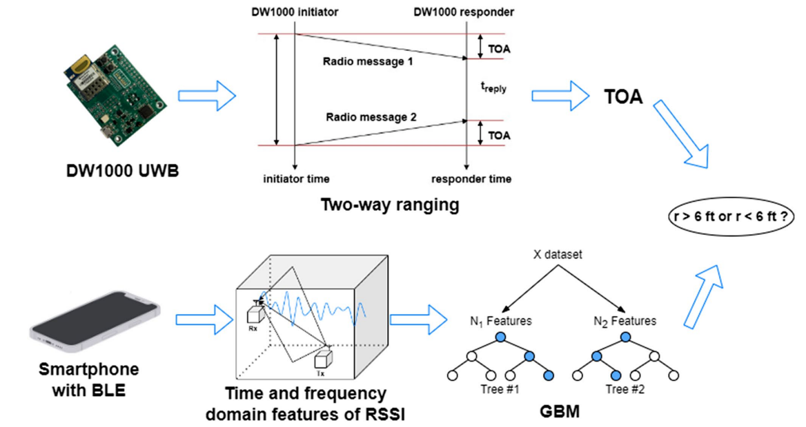

**Duration:** May 2021 – August 2022  
**Role:** Software Engineer  
**Advisor:** [Dr. Kaveh Pahlavan](https://en.wikipedia.org/wiki/Kaveh_Pahlavan) & [Dr. Emmanuel Agu](https://www.wpi.edu/people/faculty/emmanuel)

## Overview

This study compares the proximity detection performance of **Ultra-Wideband (UWB) Time of Arrival (TOA)** and **Bluetooth Low Energy (BLE) Received Signal Strength Indicator (RSSI) enhanced by machine learning** during epidemics. The research evaluates the accuracy and computational complexity of UWB TOA and BLE RSSI in various environments, including Line-of-Sight (LOS) and Obstructed-Line-of-Sight (OLOS) scenarios. The study aims to provide insights into the reliability and robustness of UWB and BLE technologies for proximity detection in real-time applications.

In this project, I served as a **Software Engineer**, contributing to the design of the data collection pipeline for **Ultra-Wideband (UWB) technology**. The project compared the **Time of Arrival (TOA)** method with **RSSI-based BLE** enhanced by machine learning for proximity detection during epidemics. This work involved empirical experiments in various environments and evaluated the reliability of UWB and BLE for detecting proximity in both **Line-of-Sight (LOS)** and **Obstructed-Line-of-Sight (OLOS)** scenarios.

## Key Contributions
- **Data Collection Pipeline**: Developed the **UWB data collection pipeline**, enabling reliable data capture for comparison with BLE RSSI in the same environments.
- **Software Engineering**: Assisted in implementing the experimental setup, ensuring seamless data processing and real-time analysis.

## Novelty
- The study provides an empirical comparison of **UWB TOA** and **BLE RSSI with machine learning** for proximity detection, highlighting UWB's higher accuracy and lower complexity in real-time applications.
